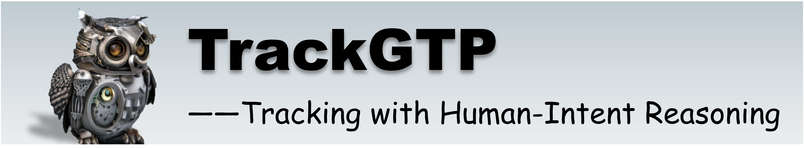
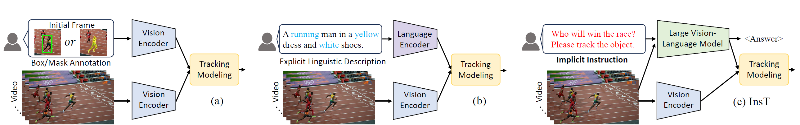
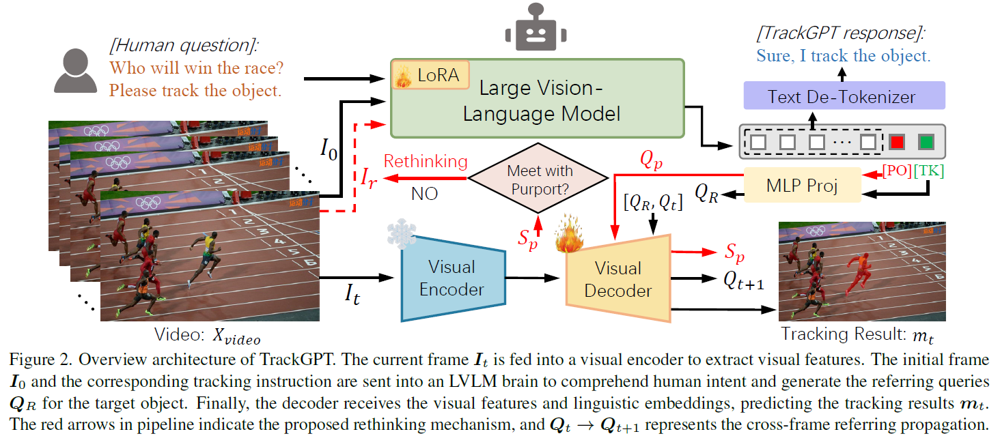
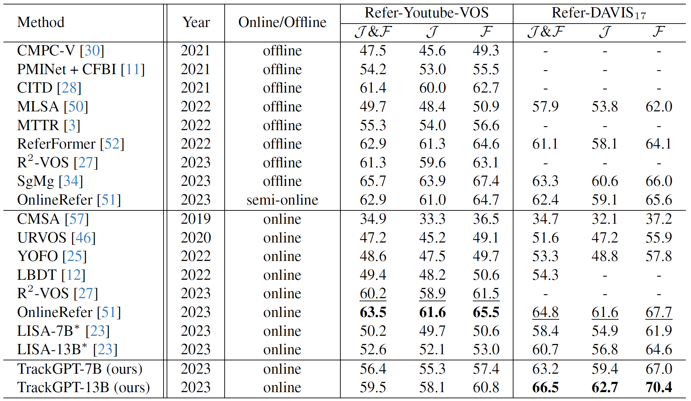
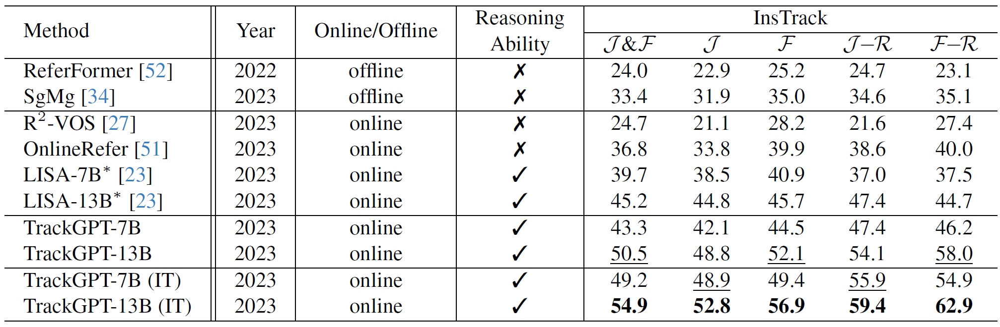

<div align=center>

</div>

<div align="center">
    <a href="https://pytorch.org"></a>
    <a href="https://github.com/jiawen-zhu/TrackGPT/blob/main/LICENSE"></a>
    <a href="https://arxiv.org/abs/231211.xxx"></a>
</div>

<div align=center>

</div>

***TrackGPT*** is a new tracking architecture that is capable of performing complex reasoning-based tracking 
by injecting (Large Vision-Language Model) LVLM's comprehension of the multi-modal world.
A new tracking task, ***Instruction Tracking*** (InsT), is proposed simultaneously in a context 
where perception and comprehension tasks are no longer clearly demarcated.
We undertake this modest attempt to advance next-generation object tracking with more intelligence.

<td><center></center></td>
<td><center></center></td>

## :loudspeaker:News
- [2023/12/31] We make TrackGPT public.

## :fire: Highlight

* A new task called **instruction tracking** (InsT) is proposed, where a tracker must have the self-reasoning capability, 
autonomously interpret implicit instruction and track the target object. This human-tracker interaction paradigm
aligns better with the way humans ask questions.

* A benchmark, **InsTrack**, is also constructed for instruction tuning and evaluation.


* This work present **TrackGPT**, a tracker that can comprehend human intent
by leveraging the reasoning capability of LVLM. TrackGPT is designed sticking to a principle of simple yet effective, 
we hope this work could catalyze more compelling research in the future.

<div align=center>

</div>

## :memo: Results

*  Referring Tracking
<div align=center>

</div>

*  Instruction Tracking
<div align=center>

</div>

## :bookmark_tabs:Installation
* Install the conda environment
```
conda create -n trackgpt python=3.9
conda activate trackgpt
```
* Install the required packages:
```
pip install -r requirements.txt
pip install flash-attn --no-build-isolation
```

## :car:Run TrackGPT
```
sh TrackGPT_demo.sh
```
For example，
```
Please input your tracking instrcution: I'd like to focus on the protagonist of this street event. Please track the object.
Please input the video path: test_videos/breakdance
```

## :hearts: Acknowledgment
This project is based on [LISA](https://github.com/dvlab-research/LISA) and [LLaVA](https://github.com/haotian-liu/LLaVA). 
Thanks for these excellent works.

## :book: Citation
If you find TrackGPT useful for you, please consider citing :mega:
```bibtex
@misc{trackgpt,
      Title={Tracking with Human-Intent Reasoning}, 
      Author = {Jiawen Zhu and Zhi-Qi Cheng and Jun-Yan He and Chenyang Li and Bin Luo and Huchuan Lu and Yifeng Geng and Xuansong Xie},
      Year = {2023},
      Eprint = {arXiv:2312.xxx},
      PrimaryClass={cs.CV}
}
```
